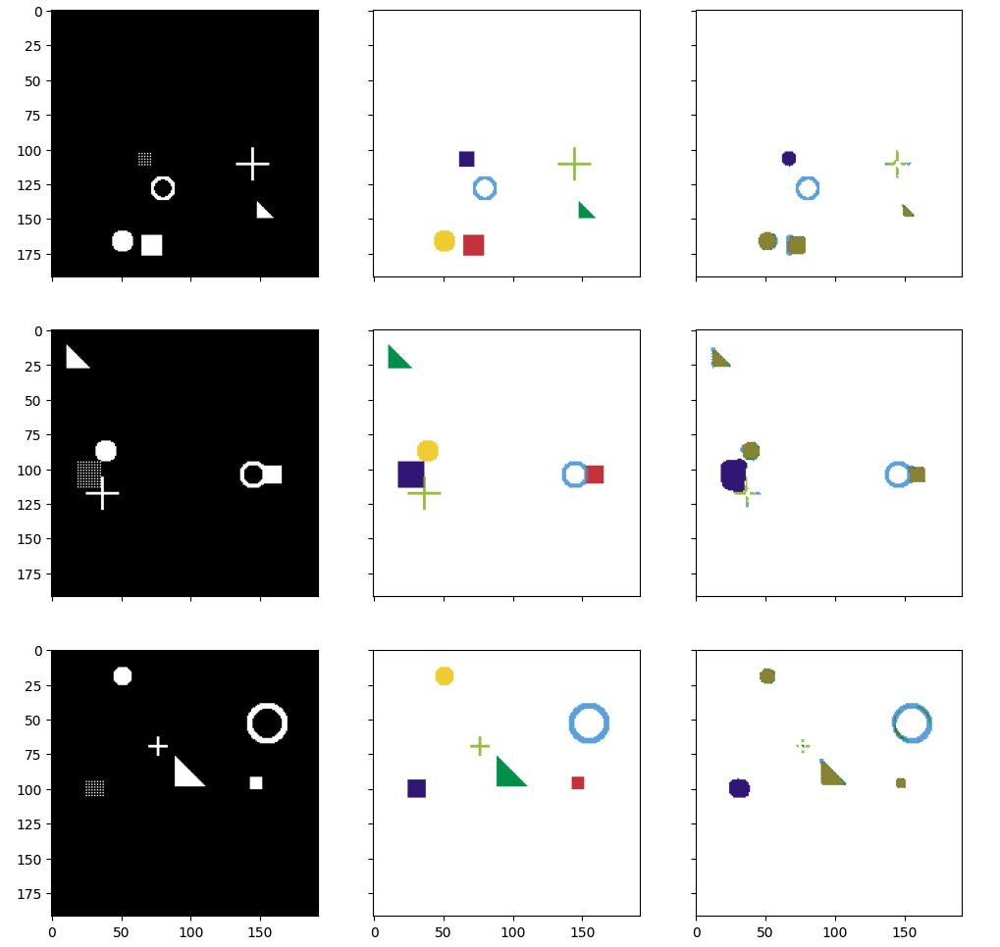

UNet
----
Implementation of UNet, applying basic UNet and transfer learning.

Mainly contain four files, `model_part.py`, `model.py`, `train.py`, `testModel.py`.

1. `model_part.py`, contains function for **double convolution layer**, **down sampling**, and **up sampling**.
2. `model.py` is the main model, which build the basic UNet model from the origin paper.
3. `train.py` helps us to train the model and save model.
4. `testModel.py` is a helper file to help generate data and train the model.

Training Setup
----
I train in [colab](https://colab.research.google.com/drive/1B34Tg2b1V9dLPAvk1tmLNQKuAf4NmXdG?usp=sharing) by using T4, totally cost 3 minutes.
Final train loss is 0.241. 
Final result is below.

